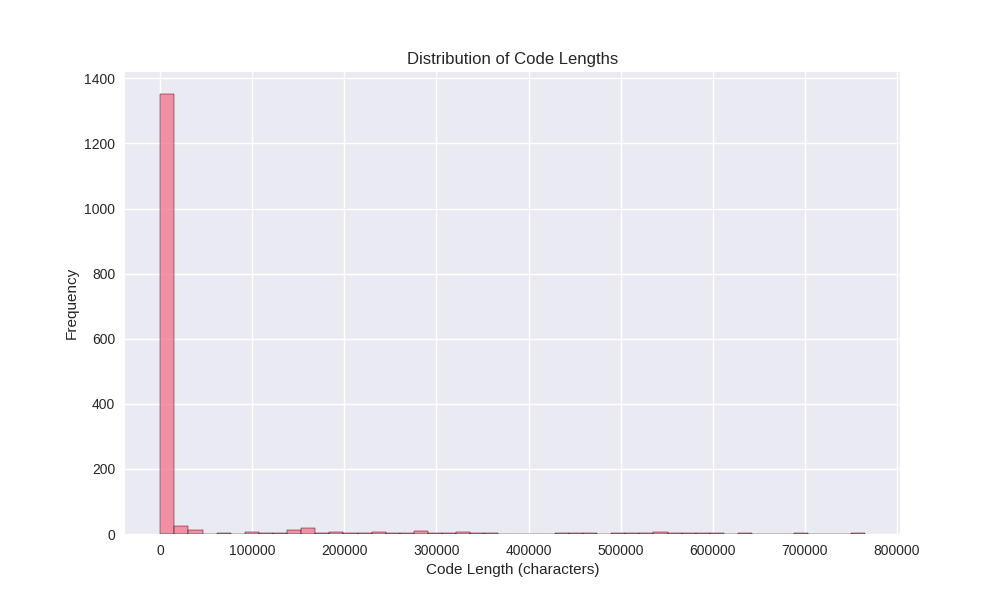
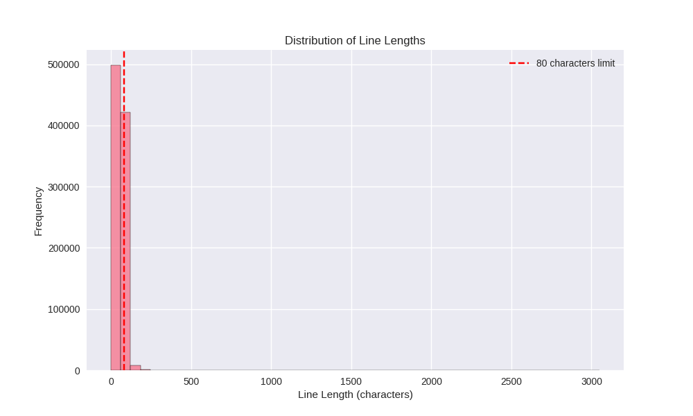
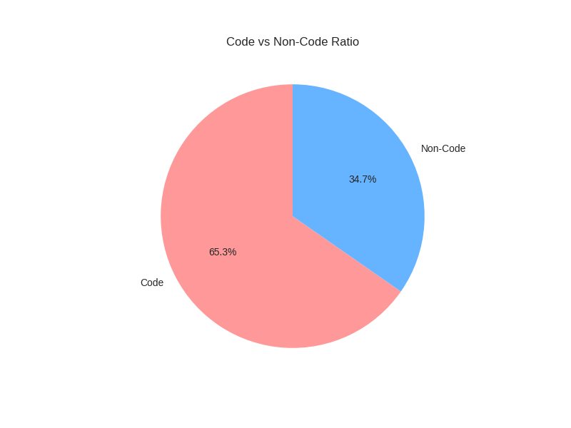
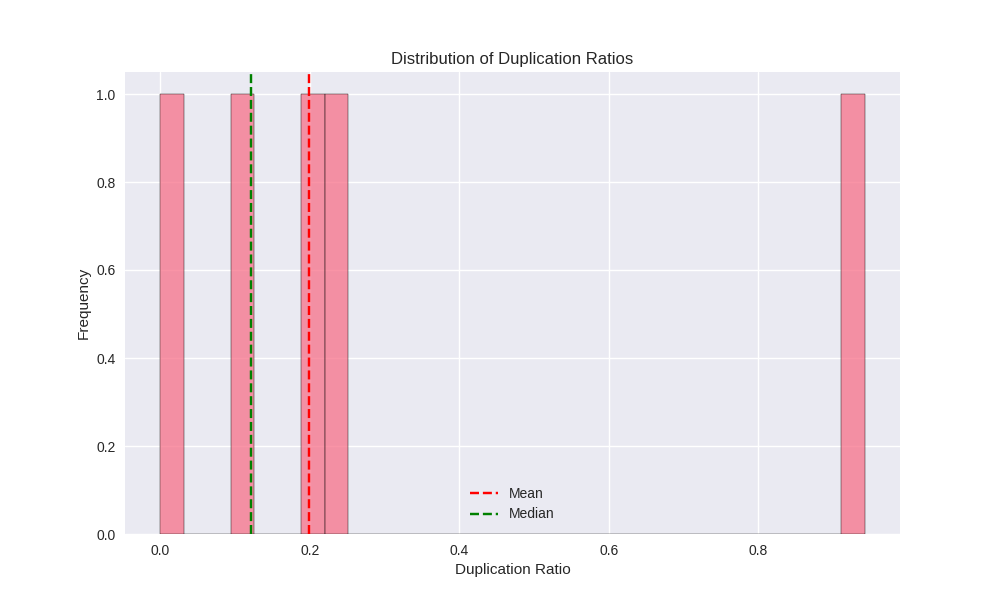
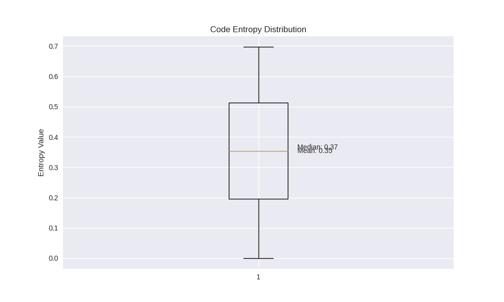
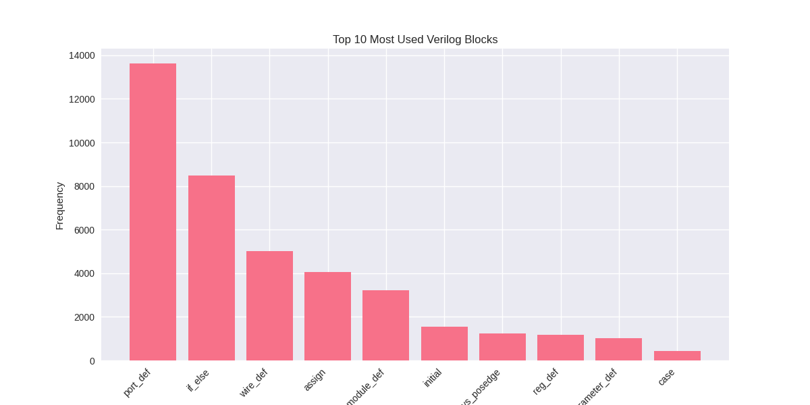

# DQEvaluator: Quality Assessment Tool for LLM Training Datasets

<div align="center">
  <a href="#english">English</a> | <a href="#chinese">中文</a>
</div>

## Table of Contents
- [Introduction](#introduction)
- [Research Value](#research-value)
- [Key Features](#key-features)
- [Project Structure](#project-structure)
- [Installation](#installation)
- [Usage](#usage)
- [Scoring Criteria](#scoring-criteria)
- [Configuration](#configuration)
- [Sample Analysis](#sample-analysis)
- [Notes](#notes)
- [License](#license)
- [Future Plans](#future-plans)
- [Version History](#version-history)

<h2 id="english">English Documentation</h2>

## Introduction
DQEvaluator is a specialized tool for assessing the quality of training datasets for large language models. Currently focusing on Verilog hardware description language code datasets, it evaluates code quality through multi-dimensional analysis to provide high-quality dataset selection criteria for LLM training. The tool supports batch processing of large-scale CSV files, provides dataset-level statistical analysis, and can be used to study the impact of data quality on LLM performance.

## Research Value
### 1. Data Quality Assessment
- Provides objective quality scoring criteria for LLM training datasets
- Multi-dimensional analysis ensures dataset comprehensiveness
- Identifies and filters low-quality code samples
- Provides detailed quality analysis reports and visualizations

### 2. Model Performance Research
- Enables training multiple models based on different quality scores
- Studies correlation between data quality and model performance
- Explores optimal data quality thresholds
- Provides data selection criteria for model training

### 3. Extensibility Design
- Currently supports Verilog code evaluation
- Framework designed to extend to other programming languages
- Customizable scoring criteria and weights
- Easy to add new analysis dimensions

## Key Features
### 1. Multi-dimensional Code Analysis
- Code length analysis
- Line length analysis
- Code complexity analysis
- Duplication detection
- Entropy analysis

### 2. Scoring System
- Multi-dimensional comprehensive scoring
- A-F grade assessment
- Independent dimension scoring
- Dataset average score calculation

### 3. Visualization Reports
- Code length distribution
- Line length distribution (with 80-character limit line)
- Code complexity pie chart
- Duplication analysis chart
- Pattern type distribution
- Entropy analysis box plot
- Verilog block frequency chart

## Project Structure
```
DQEvaluator/
├── main.py                    # Main program entry
├── config/                    # Configuration files
│   ├── analysis_config.py     # Analysis configuration
│   └── scoring_config.py      # Scoring configuration
├── analyzers/                 # Analyzer modules
│   ├── length_analyzer.py     # Code length analysis
│   ├── complexity_analyzer.py # Code complexity analysis
│   ├── duplication_analyzer.py# Code duplication analysis
│   ├── entropy_analyzer.py    # Code entropy analysis
│   └── code_scorer.py        # Code scorer
├── visualizers/               # Visualization modules
│   └── code_visualizer.py     # Code visualization tool
├── data/                      # Data directory
│   └── *.csv                 # CSV format code files
└── results/                   # Results output directory
    └── [filename]_[timestamp]/# Each file's analysis result directory
        ├── *_report.json     # JSON format analysis report
        ├── *_stats.txt       # Text format statistics
        └── *.png             # Visualization charts
```

## Installation
### Environment Requirements
- Python 3.7+
- Linux/Unix systems (recommended)

### Dependencies
```bash
pip install -r requirements.txt
```

Main dependencies:
- pandas: Data processing and analysis
- numpy: Numerical computation
- matplotlib: Data visualization
- seaborn: Statistical data visualization
- tqdm: Progress bar display

## Usage
### 1. Prepare Data
- Save Verilog code text data as CSV files
- CSV files must contain `text` column
- Place all CSV files in `data` directory

### 2. Run Analysis
```bash
python main.py
```

### 3. View Results
Program will create a separate result directory for each CSV file in `results` directory:
```
results/
└── [filename]_[timestamp]/
    ├── [filename]_report.json     # Complete analysis data
    ├── [filename]_stats.txt       # Statistics
    ├── length_distribution.png    # Code length distribution
    ├── line_length_distribution.png# Line length distribution
    ├── complexity_distribution.png # Code complexity
    ├── duplication_analysis.png   # Duplication analysis
    ├── duplication_patterns.png   # Duplication pattern distribution
    ├── entropy_analysis.png       # Entropy analysis
    └── verilog_blocks.png         # Verilog block distribution
```

## Scoring Criteria
### Dimension Weights
- Line statistics (Line Statistics): 30%
- Code length (Code Length): 15%
- Complexity (Complexity): 20%
- Duplication (Duplication): 25%
- Entropy (Entropy): 10%

### Scoring Grades
- A: 90-100 points
- B: 80-89 points
- C: 70-79 points
- D: 60-69 points
- F: 0-59 points

## Configuration
### Analysis Configuration (analysis_config.py)
- Line length limit
- Duplication detection threshold
- Sampling parameters
- Analysis parameters

### Scoring Configuration (scoring_config.py)
- Dimension weights
- Scoring thresholds
- Metric ranges

## Sample Analysis
### Single File Score
```
=== Code Quality Score - example.csv ===
Final Score: 75.5
Grade: C

Dimension Scores:
  code_length: 78.0
  line_stats: 82.5
  complexity: 70.8
  duplication: 68.9
  entropy: 77.3
```

### Dataset Score
```
=== Dataset Average Scores ===
Final Score: 72.8
Grade: C

Dimension Scores:
  code_length: 75.5
  line_stats: 80.2
  complexity: 69.7
  duplication: 65.8
  entropy: 73.0
```

## Notes
1. Ensure correct CSV file format
2. Large file analysis may take longer, adjustable through analysis configuration
3. Scoring criteria may need further adjustment based on expert knowledge

## License
Copyright (c) 2024 Rujia Wang

### Terms of Use
This software and associated documentation are for academic research and personal learning only.

### Terms of Use
- Permitted: Personal learning, academic research, non-commercial sharing and use, code contributions through pull requests
- Prohibited: Any commercial use, including but not limited to: sales, rental, commercial services, etc.
- Required:
  1. Any academic work using this software must properly cite it as follows:
     ```
     @misc{dqevaluator2024,
       author = {Wang, Rujia},
       title = {DQEvaluator: Quality Assessment Tool for LLM Training Datasets},
       year = {2024},
       publisher = {GitHub},
       url = {https://github.com/rujiawang329/DQEvaluator}
     }
     ```
  2. This copyright notice must be retained in any use

For permissions and inquiries, please contact: rujiawang329@gmail.com

## Future Plans

### Short-term Goals
1. **Expand Evaluation Dimensions**
   - Add more code quality metrics
   - Incorporate semantic analysis
   - Include documentation quality assessment
   - Add test coverage analysis

2. **Optimize Scoring System**
   - Adjust weights based on expert knowledge
   - Implement dynamic weight adjustment
   - Add customizable scoring criteria
   - Develop domain-specific scoring models

3. **Language Support**
   - Add support for Python
   - Add support for Java
   - Add support for C/C++
   - Support other popular programming languages

### Long-term Goals
1. **LLM Performance Research**
   - Study correlation between dataset quality and model performance
   - Train models on datasets with different quality scores
   - Analyze impact of specific quality metrics on model capabilities
   - Develop quality benchmarks for LLM training data

2. **Universal Dataset Evaluator**
   - Extend beyond code datasets
   - Support text corpus evaluation
   - Add multi-modal data assessment
   - Develop general quality metrics

3. **Community and Collaboration**
   - Build benchmark datasets
   - Collaborate with research institutions
   - Establish quality standards
   - Create documentation and tutorials

## Version History

### v1.0.0 (2024-12)
- Initial release of DQEvaluator
- Multi-dimensional code analysis system
  - Code length analysis
  - Line length analysis
  - Code complexity analysis
  - Duplication detection
  - Entropy analysis
- Comprehensive scoring system (A-F grades)
- Visualization tools for analysis results
- Support for Verilog code datasets
- Batch processing for CSV files
- Dataset-level statistical analysis

<h2 id="chinese">中文文档</h2>

## 目录
- [项目简介](#项目简介)
- [研究价值](#研究价值)
- [主要功能](#主要功能)
- [项目结构](#项目结构)
- [安装和依赖](#安装和依赖)
- [使用方法](#使用方法)
- [评分标准](#评分标准)
- [配置说明](#配置说明)
- [示例分析结果](#示例分析结果)
- [注意事项](#注意事项)
- [许可证](#许可证)
- [未来计划](#未来计划)
- [版本历史](#版本历史)

## 项目简介
DQEvaluator是一个专门用于评估大语言模型训练数据集质量的工具。目前主要针对Verilog硬件描述语言代码数据集，通过多维度分析来评估代码质量，为大语言模型训练提供高质量的数据集筛选标准。该工具支持批量处理大规模CSV文件，提供数据集级别的统计分析，并可用于研究数据质量对大语言模型性能的影响。

## 研究价值

### 1. 数据质量评估
- 为大语言模型训练数据集提供客观的质量评分标准
- 多维度分析确保数据集的全面性和代表性
- 识别和过滤低质量的代码样本
- 提供详细的质量分析报告和可视化结果

### 2. 模型性能研究
- 可基于不同质量分数的数据集训练多个模型
- 研究数据质量与模型性能的相关性
- 探索最优的数据质量阈值
- 为模型训练提供数据筛选依据

### 3. 扩展性设计
- 当前支持Verilog代码评估
- 框架设计支持扩展到其他编程语言
- 可自定义评分标准和权重
- 便于添加新的分析维度

## 主要功能

### 1. 多维度代码分析
- **代码长度分析**
  - 代码字符数和行数统计
  - 行长度分布分析
  - 代码量分布可视化
- **代码复杂度分析**
  - 代码、注释和空白行比例分析
  - 代码结构复杂度评估
  - 代码组成可视化
- **代码重复检测**
  - 行级和块级重复分析
  - 重复模式识别和分类
  - 重复度统计和可视化
- **代码熵分析**
  - 全局代码熵计算
  - Verilog块使用频率分析
  - 熵分布可视化

### 2. 评分系统
- 多维度综合评分
- A-F等级评定
- 各维度独立评分
- 数据集平均分计算

### 3. 可视化报告
- 代码长度分布图
- 行长度分布图（带80字符限制线）
- 代码复杂度饼图
- 重复度分析图（带均值和中位数线）
- 重复模式类型分布图
- 熵分析箱线图
- Verilog块使用频率图

## 项目结构
```
DQEvaluator/
├── main.py                    # 主程序入口
├── config/                    # 配置文件
│   ├── analysis_config.py     # 分析配置
│   └── scoring_config.py      # 评分配置
├── analyzers/                 # 分析器模块
│   ├── length_analyzer.py     # 代码长度分析
│   ├── complexity_analyzer.py # 代码复杂度分析
│   ├── duplication_analyzer.py# 代码重复分析
│   ├── entropy_analyzer.py    # 代码熵分析
│   └── code_scorer.py        # 代码评分器
├── visualizers/               # 可视化模块
│   └── code_visualizer.py     # 代码可视化工具
├── data/                      # 数据目录
│   └── *.csv                 # CSV格式的代码文件
└── results/                   # 结果输出目录
    └── [filename]_[timestamp]/# 每个文件的分析结果目录
        ├── *_report.json     # JSON格式分析报告
        ├── *_stats.txt       # 文本格式统计信息
        └── *.png             # 可视化图表
```

## 安装和依赖

### 环境要求
- Python 3.7+
- Linux/Unix系统（推荐）

### 依赖项
```bash
pip install -r requirements.txt
```

主要依赖：
- pandas: 数据处理和分析
- numpy: 数值计算
- matplotlib: 数据可视化
- seaborn: 统计数据可视化
- tqdm: 进度条显示

## 使用方法

### 1. 准备数据
- 将Verilog代码文本数据保存为CSV文件
- CSV文件必须包含`text`列
- 将所有CSV文件放在`data`目录下

### 2. 运行分析
```bash
python main.py
```

### 3. 查看结果
程序会为每个CSV文件在`results`目录下创建独立的结果目录：
```
results/
└── [filename]_[timestamp]/
    ├── [filename]_report.json     # 完整分析数据
    ├── [filename]_stats.txt       # 统计信息
    ├── length_distribution.png    # 代码长度分布
    ├── line_length_distribution.png# 行长度分布
    ├── complexity_distribution.png # 代码复杂度
    ├── duplication_analysis.png   # 重复度分析
    ├── duplication_patterns.png   # 重复模式分布
    ├── entropy_analysis.png       # 熵分析
    └── verilog_blocks.png         # Verilog块分布
```

## 评分标准

### 维度权重
- 行统计 (Line Statistics): 30%
- 代码长度 (Code Length): 15%
- 复杂度 (Complexity): 20%
- 重复度 (Duplication): 25%
- 熵 (Entropy): 10%

### 评分等级
- A: 90-100分
- B: 80-89分
- C: 70-79分
- D: 60-69分
- F: 0-59分

## 配置说明

### 分析配置 (analysis_config.py)
- 行长度限制
- 重复检测阈值
- 采样参数
- 分析参数

### 评分配置 (scoring_config.py)
- 维度权重
- 评分阈值
- 指标范围

## 输出示例

### 单文件评分
```
=== Code Quality Score - example.csv ===
Final Score: 75.5
Grade: C

Dimension Scores:
  code_length: 78.0
  line_stats: 82.5
  complexity: 70.8
  duplication: 68.9
  entropy: 77.3
```

### 数据集评分
```
=== Dataset Average Scores ===
Final Score: 72.8
Grade: C

Dimension Scores:
  code_length: 75.5
  line_stats: 80.2
  complexity: 69.7
  duplication: 65.8
  entropy: 73.0
```

## 示例分析结果

以下是对一个Verilog代码数据集的分析示例：

### 1. 代码长度分布


代码长度分布图显示了数据集中代码的字符数分布情况，帮助识别异常长度的代码样本。

### 2. 行长度分布


行长度分布图展示了代码行的长度分布，红线标记了80字符的推荐限制。

### 3. 代码复杂度


复杂度饼图展示了代码与非代码（注释、空行等）的比例分布。

### 4. 代码重复度


重复度分析图显示了代码重复的程度分布，包括均值和中位数标记。

### 5. 代码熵分析


熵分析箱线图展示了代码的信息熵分布特征。

### 6. Verilog块分布


Verilog块分布图展示了最常用的Verilog语言结构的使用频率。

## 注意事项
1. 确保CSV文件格式正确
2. 大文件分析可能需要较长时间，可以通过调控分析配置来加速
3. 评分标准可能需要根据专家知识进一步调整

## 许可证
Copyright (c) 2024 Rujia Wang

### 许可证条款
本软件及其相关文档仅限于学术研究和个人学习使用。

### 使用条款
- 允许：个人学习、学术研究、非商业性分享和使用、通过pull requests贡献代码
- 禁止：任何商业用途，包括但不限于：销售、出租、商业服务等
- 要求：
  1. 在任何学术工作中使用本软件，必须按照以下格式引用：
     ```
     @misc{dqevaluator2024,
       author = {Wang, Rujia},
       title = {DQEvaluator: Quality Assessment Tool for LLM Training Datasets},
       year = {2024},
       publisher = {GitHub},
       url = {https://github.com/rujiawang329/DQEvaluator}
     }
     ```
  2. 在任何使用中必须保留本版权声明

如需获得许可或有任何疑问，请联系：rujiawang329@gmail.com

## 未来计划

### 短期目标
1. **拓展评估维度**
   - 增加更多代码质量指标
   - 引入语义分析
   - 加入文档质量评估
   - 添加测试覆盖率分析

2. **优化评分系统**
   - 根据专家知识调整权重
   - 实现动态权重调整
   - 添加可定制评分标准
   - 开发领域特定评分模型

3. **语言支持**
   - 增加Python支持
   - 增加Java支持
   - 增加C/C++支持
   - 支持其他主流编程语言

### 长期目标
1. **大模型性能研究**
   - 研究数据集质量与模型性能的关系
   - 使用不同质量分数的数据集训练模型
   - 分析特定质量指标对模型能力的影响
   - 为模型训练提供数据筛选依据

2. **通用数据集评估工具**
   - 扩展到代码数据集之外
   - 支持文本语料评估
   - 添加多模态数据评估
   - 开发通用质量指标

3. **社区与协作**
   - 建立基准数据集
   - 与研究机构合作
   - 制定质量标准
   - 创建文档和教程

## 版本历史

### v1.0.0 (2024-12)
- DQEvaluator首次发布
- 多维度代码分析系统
  - 代码长度分析
  - 行长度分析
  - 代码复杂度分析
  - 重复检测
  - 熵分析
- 综合评分系统（A-F等级）
- 分析结果可视化工具
- 支持Verilog代码数据集
- CSV文件批量处理
- 数据集级别统计分析
